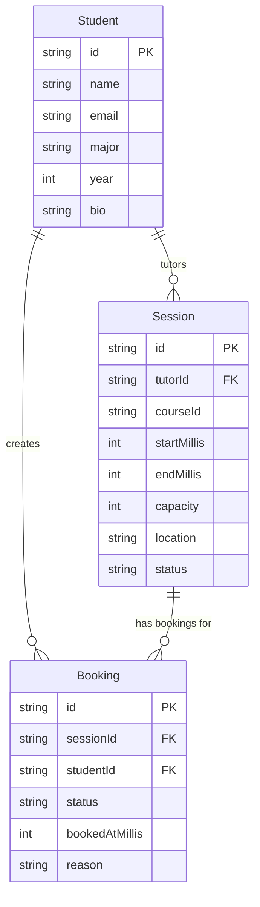

# Lab 9 - Local Persistence with Floor and SQLite

## Overview

Last week when you got async state management working with Riverpod? Your app loads sessions and bookings perfectly now. But there's a catch - every time you restart the app, it reloads the same data from JSON files. You can't actually save anything.

This week, you're fixing that. You'll replace those JSON files with a real SQLite database using Floor. After this lab, when you create a new session or booking, it'll actually stick around. The app will feel real.

## Objective

This lab is all about **Floor** - a database library for Flutter that makes SQLite easy to use. You'll learn how to:

- Annotate your entities so Floor knows they're database tables
- Create DAOs (Data Access Objects) to define database queries
- Run code generation to create all the database code automatically
- Seed initial data from JSON into the database
- Replace your JSON-based data sources with database-backed ones

## Why Floor?

You could write raw SQL code directly, but that's tedious and error-prone. Floor gives you:

- **Type safety** - Compile-time checking instead of runtime crashes
- **Code generation** - Floor writes all the SQL for you
- **Clean syntax** - Just annotations and simple queries
- **Easy to test** - Mock the DAOs if you need to

Think of Floor as a translator between your Dart objects and SQLite tables.

## ⚠️ Important: We're Taking a Shortcut

In a real production app, you'd create separate database entity classes (like `SessionEntity`) and keep your domain entities pure. Then you'd write mappers to convert between them.

**We're not doing that** in this lab. Instead, we'll add Floor annotations directly to your existing `Session` and `Booking` classes.

**Just remember:** In your final project or a real app, separate your database entities from domain entities. That's proper Clean Architecture.

---

## Database Design - Entity Relationship Diagram

Before we start coding, let's understand how our database tables relate to each other.



**Important Notes:**

- **PK** = Primary Key (unique identifier)
- **FK** = Foreign Key (reference to another table)
- We're using **strings for IDs** instead of auto-increment integers
- **DateTime values are stored as integers** (milliseconds since epoch)
- **Enums are stored as strings** (Floor limitation)

---

## How This Lab Works

You'll work through this in phases. Each phase has clear TODOs - complete all TODOs in a phase before moving to the next one.

**Here's the flow:**

1. ✅ Add Floor annotations to your entities
2. ✅ Create DAOs with query methods
3. ✅ Create the AppDatabase class
4. ✅ Run code generation
5. ✅ Create database provider
6. ✅ Create database seeder
7. ✅ Update data sources to use database
8. ✅ Update notifiers to inject database
9. ✅ Test everything!

Don't skip around. Each phase builds on the previous one.

---

## Phase 1: Annotate Your Entities

### TODO 1.1: Update Session Entity

**File:** `lib/features/session_management/domain/entities/session.dart`

**What you need to do:**

1. Import the Floor package (`package:floor/floor.dart`)
2. Add the entity annotation to mark this class as a database table
3. Add the primary key annotation to the `id` field

**Hints:**

- Look up Floor's documentation for entity and primary key annotations
- The entity is already set up with `int startMillis`, `int endMillis`, and `String status` instead of DateTime and enum
- You only need to add 3 lines total (1 import + 2 annotations)

**Expected result:** Session class can be recognized by Floor as a database table

---

### TODO 1.2: Update Booking Entity

**File:** `lib/features/booking/domain/entities/booking.dart`

**What you need to do:**

1. Import the Floor package
2. Add the entity annotation
3. Add the primary key annotation to the `id` field

**Hints:**

- Same pattern as Session entity
- The booking entity already has proper field types for Floor

**Expected result:** Booking class can be recognized by Floor as a database table

---

## Phase 2: Create DAOs

### TODO 2.1: Create SessionDao

**File:** `lib/core/data/database/daos/session_dao.dart`

**What you need to do:**

1. Create an abstract class called `SessionDao`
2. Add the DAO annotation to mark this as a Data Access Object
3. Add the following methods with appropriate annotations:

**Required Methods:**

```dart
// Get all sessions from the database
// Returns a list of all Session objects
Future<List<Session>> getAllSessions();

// Get a single session by its ID
// Returns null if not found
Future<Session?> getSessionById(String id);

// Get sessions filtered by status (e.g., "open", "closed")
// Parameter name must match the SQL query parameter
Future<List<Session>> getSessionsByStatus(String status);

// Get all sessions taught by a specific tutor
// Parameter name must match the SQL query parameter
Future<List<Session>> getSessionsByTutor(String tutorId);

// Insert a single session into the database
Future<void> insertSession(Session session);

// Insert multiple sessions at once (useful for seeding)
Future<void> insertSessions(List<Session> sessions);

// Update an existing session
Future<void> updateSession(Session session);

// Delete a specific session
Future<void> deleteSession(Session session);

// Delete all sessions from the database
Future<void> deleteAllSessions();
```

**Hints:**

- DAOs are abstract classes - you only write method signatures, Floor generates implementations
- Use `@Query()` annotation for custom SELECT queries
- Use `@insert`, `@update`, `@delete` annotations for those operations
- SQL table name matches your entity class name (`Session`)
- SQL query parameters use `:parameterName` syntax and must match method parameter names
- Use `SELECT * FROM Session` to get all rows
- Use `WHERE columnName = :parameterName` to filter
- Use `DELETE FROM Session` to delete all rows

**Expected result:** Complete DAO interface with proper Floor annotations

---

### TODO 2.2: Create BookingDao

**File:** `lib/core/data/database/daos/booking_dao.dart`

**What you need to do:**

1. Create an abstract class called `BookingDao`
2. Add the DAO annotation
3. Add the following methods with appropriate annotations:

**Required Methods:**

```dart
// Get all bookings
Future<List<Booking>> getAllBookings();

// Get a booking by ID
Future<Booking?> getBookingById(String id);

// Get all bookings for a specific session
// This helps us see who booked a session
Future<List<Booking>> getBookingsBySession(String sessionId);

// Get all bookings made by a specific student
// This helps students see their booking history
Future<List<Booking>> getBookingsByStudent(String studentId);

// Insert a single booking
Future<void> insertBooking(Booking booking);

// Insert multiple bookings (for seeding)
Future<void> insertBookings(List<Booking> bookings);

// Update a booking
Future<void> updateBooking(Booking booking);

// Delete a booking
Future<void> deleteBooking(Booking booking);

// Delete all bookings
Future<void> deleteAllBookings();
```

**Hints:**

- Follow the same pattern as SessionDao
- SQL table name is `Booking`
- Think about which column names you need to filter by (sessionId, studentId, etc.)

**Expected result:** Complete DAO interface with proper Floor annotations

---

## Phase 3: Create the Database

### TODO 3.1: Create AppDatabase Class

**File:** `lib/core/data/database/app_database.dart`

**What you need to do:**

1. Import necessary packages (dart:async, floor, sqflite, entities, DAOs)
2. Add a `part` directive pointing to the generated file
3. Create an abstract class that extends `FloorDatabase`
4. Add the Database annotation with version number and entities list
5. Add abstract getter methods for each DAO

**Template Structure:**

```dart
// TODO: Import packages
// - dart:async
// - package:floor/floor.dart
// - package:sqflite/sqflite.dart as sqflite
// - Session and Booking entities
// - SessionDao and BookingDao

// TODO: Add part directive
// Filename will be 'app_database.g.dart'

// TODO: Add Database annotation
// Version: 1
// Entities: Session and Booking
abstract class AppDatabase extends FloorDatabase {
  // TODO: Add getter for SessionDao

  // TODO: Add getter for BookingDao
}
```

**Hints:**

- `part` directive syntax: `part 'filename.dart';`
- Database annotation needs version number and list of entity classes
- Getters are abstract (just the signature, no body)
- Floor will generate the implementation

**Expected result:** Database class ready for code generation

---

## Phase 4: Run Code Generation

### TODO 4.1: Generate Database Code

**Run this command in terminal:**

```bash
flutter packages pub run build_runner build --delete-conflicting-outputs
```

**What this does:**

- Scans your code for Floor annotations
- Generates a `.g.dart` file with all the database implementation code
- Creates helper classes and builders

**Expected output:**

```
[INFO] Generating build script...
[INFO] Running build...
[INFO] Succeeded after XXs with XX outputs
```

**Troubleshooting:**

- Make sure all files have proper imports
- Check that annotations are spelled correctly
- Verify `part` directive matches the generated filename

**Expected result:** `app_database.g.dart` file appears

---

## Phase 5: Create Database Provider

### TODO 5.1: Create DatabaseProvider

**File:** `lib/core/data/database/database_provider.dart`

**What you need to do:**

1. Import flutter_riverpod and app_database
2. Create a FutureProvider that builds and returns the database

**Hints:**

- Use `FutureProvider<AppDatabase>` since database creation is async
- The generated builder class has a `$` prefix: `$FloorAppDatabase`
- Use `.databaseBuilder('database_filename.db')` to specify the file
- Use `.build()` to create the database
- Name your database file `campus_hub.db`

**Expected result:** Provider that creates and provides database instance

---

## Phase 6: Create Database Seeder

### TODO 6.1: Create DatabaseSeeder Class

**File:** `lib/core/data/database/database_seeder.dart`

**What you need to do:**

1. Create a class with a static method to seed the database
2. Check if database already has data (to avoid seeding twice)
3. Load JSON data for sessions
4. Load JSON data for bookings
5. Insert data into database

**Template:**

```dart
// TODO: Import necessary packages
// - dart:convert (for json.decode)
// - package:flutter/services.dart (for rootBundle)
// - Session and Booking entities
// - AppDatabase

class DatabaseSeeder {
  static Future<void> seedDatabase(AppDatabase database) async {
    // TODO: Check if already seeded
    // Get all sessions and check if list is not empty
    // If not empty, return early

    // TODO: Load sessions JSON
    // Use rootBundle.loadString() with 'assets/json/sessions_sample.json'
    // Parse with json.decode()
    // Map to Session objects using Session.fromJson()
    // Insert using database.sessionDao.insertSessions()

    // TODO: Load bookings JSON
    // Same process with 'assets/json/bookings_sample.json'
    // Map to Booking objects
    // Insert using database.bookingDao.insertBookings()
  }
}
```

**Hints:**

- `rootBundle.loadString('path/to/file.json')` loads JSON files
- `json.decode(jsonString)` returns a `List<dynamic>`
- Use `.map((json) => EntityClass.fromJson(json)).toList()` to convert
- Bulk insert methods are faster than inserting one by one

**Expected result:** Seeder that populates database from JSON files

---

## Phase 7: Update Data Sources

### TODO 7.1: Update SessionLocalDataSource

**File:** `lib/features/session_management/data/datasources/local/session_local_data_source_impl.dart`

**What you need to do:**

1. Remove JSON loading code
2. Add SessionDao field
3. Update constructor to take SessionDao
4. Replace all JSON operations with DAO calls

**Methods to update:**

- `getSessions()` - should call DAO's get all method
- `saveSession()` - should call DAO's insert method
- `updateSession()` - should call DAO's update method
- `deleteSession()` - should call DAO's delete method (fetch session first, then delete)

**Hints:**

- Import the DAO class
- Store DAO as a private field
- No more `rootBundle` or JSON parsing
- All operations go through the DAO

**Expected result:** Data source that uses database instead of JSON

---

### TODO 7.2: Update BookingLocalDataSource

**File:** `lib/features/booking/data/datasources/local/booking_local_data_source_impl.dart`

**What you need to do:**
Same pattern as SessionLocalDataSource:

1. Add BookingDao field
2. Update constructor
3. Replace JSON operations with DAO calls

**Methods to update:**

- `getAllBookings()`
- `getBookingsByStudent()`
- `getBookingsBySession()`
- `getBookingById()`
- `insertBooking()`
- `updateBooking()`
- `deleteBooking()`

**Expected result:** Data source that uses database instead of JSON

---

## Phase 8: Update Notifiers

### TODO 8.1: Update SessionNotifier

**File:** `lib/features/session_management/presentation/providers/session_notifier.dart`

**What you need to do:**

1. Import database_provider and database_seeder
2. Update `_initializeRepository` method to:
   - Get database from the provider
   - Call the seeder
   - Pass database to data source

**Template:**

```dart
// TODO: Add imports for database_provider and database_seeder

// In _initializeRepository method:
Future<void> _initializeRepository() async {
  // TODO: Get database using ref.read()
  // Hint: databaseProvider is a FutureProvider, use .future

  // TODO: Call DatabaseSeeder.seedDatabase() with the database

  // TODO: Create data source, passing the DAO from database
  // Hint: database.sessionDao

  // TODO: Create repository (this stays the same)
}
```

**Hints:**

- Use `await ref.read(databaseProvider.future)` to get database
- Pass `database.sessionDao` to SessionLocalDataSource constructor

**Expected result:** Notifier that initializes database and triggers seeding

---

### TODO 8.2: Update BookingNotifier

**File:** `lib/features/booking/presentation/providers/booking_notifier.dart`

**What you need to do:**
Follow the same pattern as SessionNotifier:

1. Add imports
2. Get database from provider
3. Call seeder
4. Pass database.bookingDao to data source

**Expected result:** Notifier that initializes database and triggers seeding

---

## Phase 9: Test Everything!

### TODO 9.1: Run and Verify

```bash
flutter run
```

**Verification Checklist:**

- [ ] App compiles without errors
- [ ] Sessions list shows data
- [ ] Bookings list shows data
- [ ] Close app and reopen - data still there
- [ ] Second launch doesn't re-seed (check console)

**If you see errors:**

| Error                               | Likely Cause               | Solution                            |
| ----------------------------------- | -------------------------- | ----------------------------------- |
| "Table doesn't exist"               | Code generation issue      | Re-run build_runner                 |
| "No such file: app_database.g.dart" | Didn't run code generation | Run build_runner command            |
| No data appears                     | Seeding failed             | Check console for errors            |
| Data disappears                     | Still using JSON           | Make sure data sources use database |

---

### Type Conversions to Remember

```dart
// DateTime to milliseconds
int millis = dateTime.millisecondsSinceEpoch;

// Milliseconds to DateTime
DateTime dt = DateTime.fromMillisecondsSinceEpoch(millis);

// Enum to String
String str = myEnum.value;

// String to Enum
MyEnum e = MyEnum.fromString(str);
```

---

**Need help?** Check the solutions document for complete code examples.

**Congratulations on completing Lab 9!**
